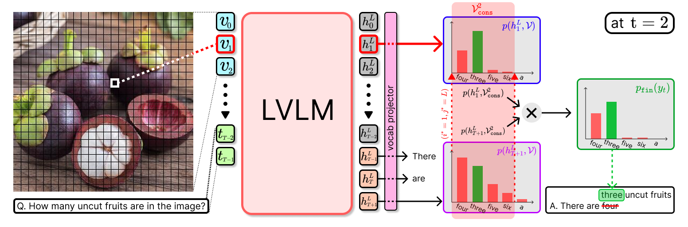

<h1 align="center"> Revisit What You See: Disclose Language Prior in <br> Vision Tokens for Efficient Guided Decoding of LVLMs
</h1>

[](https://arxiv.org/abs/2506.09522)&nbsp;
[](https://huggingface.co/papers/2506.09522)&nbsp;
[](LICENSE)

<div align="center">
  <a href="https://bscho333.notion.site/" target="_blank">Beomsik&nbsp;Cho</a><sup>1</sup> &ensp; <b>&middot;</b> &ensp;
  <a href="https://sites.google.com/view/jaehyungkim" target="_blank">Jaehyung&nbsp;Kim</a><sup>1</sup> &ensp; <br>
  <sup>1</sup> Yonsei University &emsp; <br>
</div>
<br>


## Overview
  <p align="center">
    
  </p>

**ReVisiT** is a decoding-time algorithm for LVLMs that improves visual grounding by using internal vision tokens as reference informers. It projects vision tokens into the text token space, selects the most relevant one through constrained divergence minimization, and guides generation to better align with visual semantics without modifying the underlying model.


## Implementation

Due to differences in the supported Transformers versions for each LVLM family, we provide separate implementations for LLaVA-1.5 and Qwen2.5-VL.  
LLaVA-1.5 is based on Transformers v4.31.0, while Qwen2.5-VL is based on v4.50.0, reflecting compatibility requirements with their respective tokenizer and model wrappers.  
Although the core ReVisiT decoding logic remains the same, these version-specific dependencies necessitate isolated environments and tailored integration scripts per model.

If you wish to integrate ReVisiT into your own environment, simply add the corresponding decoding function to the Huggingface Transformers source code.
Specifically, copy the code from:
- For v4.31.0: [`LLaVA1.5/data/transformers-4.31.0/src/transformers/generation/utils.py` (lines 2472–2851)](https://github.com/bscho333/ReVisiT/blob/main/LLaVA1.5/data/transformers-v4.31.0/src/transformers/generation/utils.py#L2472-L2851)
- For v4.50.0: [`Qwen2.5-VL/data/transformers-4.50.0/src/transformers/generation/utils.py` (lines 2579–2830)](https://github.com/bscho333/ReVisiT/blob/main/Qwen2.5-VL/data/transformers-v4.50.0/src/transformers/generation/utils.py#L2579-L2830)

and paste it into your local `transformers/generation/utils.py`.

The following section provides CHAIR evaluation scripts and instructions for each model.

  ### Prerequisite
  ```
  bash prerequisites/download_coco.sh
  ```
  ### LLaVA1.5
  **Environment setup**
  ```
  conda env create -f LLaVA1.5/ReVisiT_LLaVA.yaml
  conda activate revisit_llava
  pip install numpy==1.26.4
  cd LLaVA1.5/data/transformers-v4.31.0
  pip install -e .
  cd ../../..

  python prerequisites/download_from_huggingface.py --model llava
  ```
  **CHAIR Evaluation**
  ```
  cd LLaVA1.5
  bash eval_chair_llava.sh
  ```

  ### Qwen2.5-VL
  **Environment setup**
  ```
  conda env create -f Qwen2.5-VL/ReVisiT_Qwen.yaml
  conda activate revisit_qwen
  cd Qwen2.5-VL/data/transformers-v4.50.0
  pip install -e .
  cd ../../..

  python prerequisites/download_from_huggingface.py --model qwen
  ```
  **CHAIR Evaluation**
  ```
  cd Qwen2.5-VL
  bash eval_chair_qwenvl.sh
  ```
## Acknowledgements
This repository builds upon the open-source implementations of [LLaVA](https://github.com/haotian-liu/LLaVA), [VCD](https://github.com/DAMO-NLP-SG/VCD), and [RITUAL](https://github.com/sangminwoo/RITUAL).  
We sincerely thank the authors for making their code publicly available.


## Citation
If you find our work helpful, please consider citing:

```bibtex
@article{cho2025revisit,
  title     = {Revisit What You See: Disclose Language Prior in Vision Tokens for Efficient Guided Decoding of LVLMs},
  author    = {Beomsik Cho and Jaehyung Kim},
  journal   = {arXiv preprint arXiv:2506.09522},
  year      = {2025},
  url       = {https://arxiv.org/abs/2506.09522}
}
```